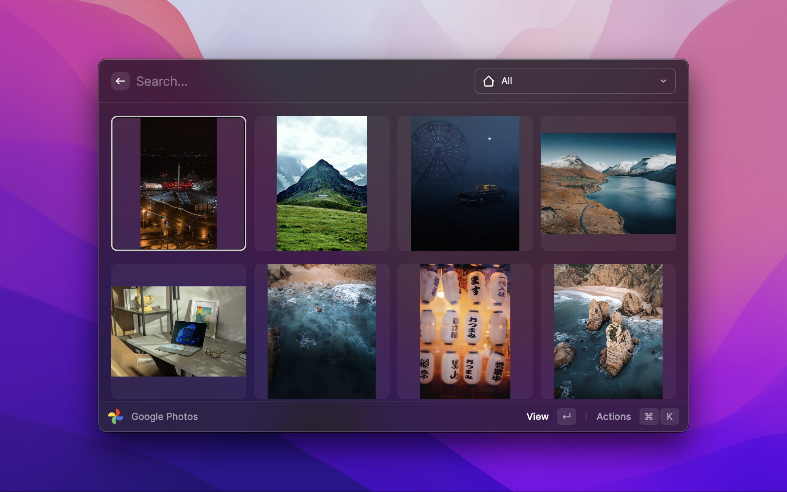
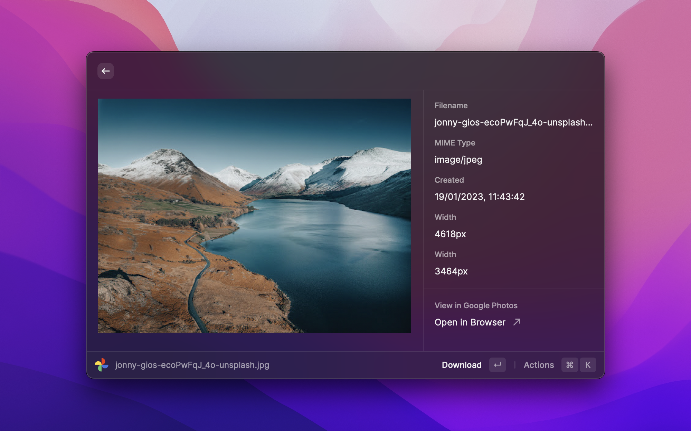
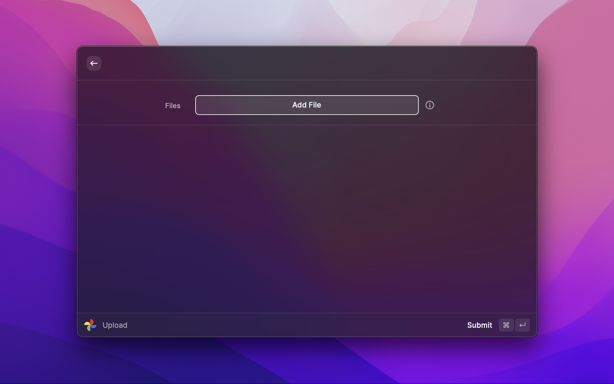

# A Raycast extension from Google Photos

## Features

- View your Google Photos media
- Search by category
- download media
- Upload media

## Setup

### Prerequisites

- [Node.js](https://nodejs.org/en/download/)
- [Raycast](https://raycast.com/download)

```bash
git clone https://github.com/BalliAsghar/google-photos
cd google-photos
npm install
```

```bash
npm run build
```




